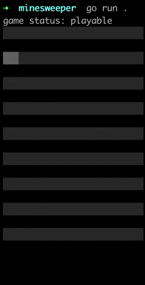

# vim minesweeper

a simple project to learn the [bubbletea](https://github.com/charmbracelet/bubbletea) tui framework. This is currently in MVP, with future plans to improve.



# to run
- make sure to have a recent version
of go installed
- from your terminal navigate to this directory  
```bash
go mod tidy
go run .
```

# to play
- using h, j, k, l navigate the cursor

- press the space bar to select the cell

- press m to flag the cell

- press r to reset the board

- press q to quit

# todos
- [ ] create classic games "l+r" click functionality (clears all cells around a cell without flags)
- [x] create menu to configure the game
- [x] add timer
- [ ] add view of the number of "potential" mines (# of mines - # of flags placed)
- [ ] ~~add mouse control~~
- [ ] create scoreboard
- [ ] make this into vim go! (Where all the operations are exclusively std vim operations)
- [ ] create light and dark mode